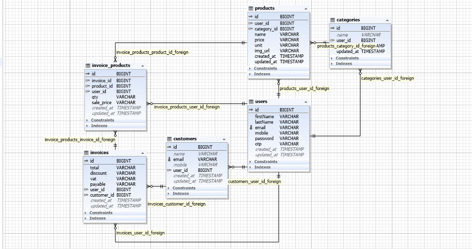
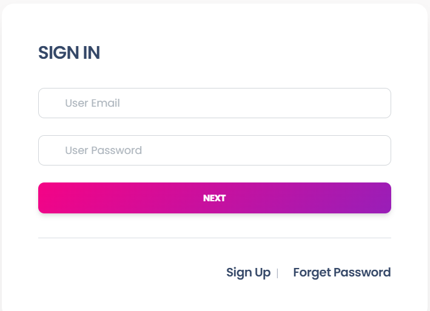
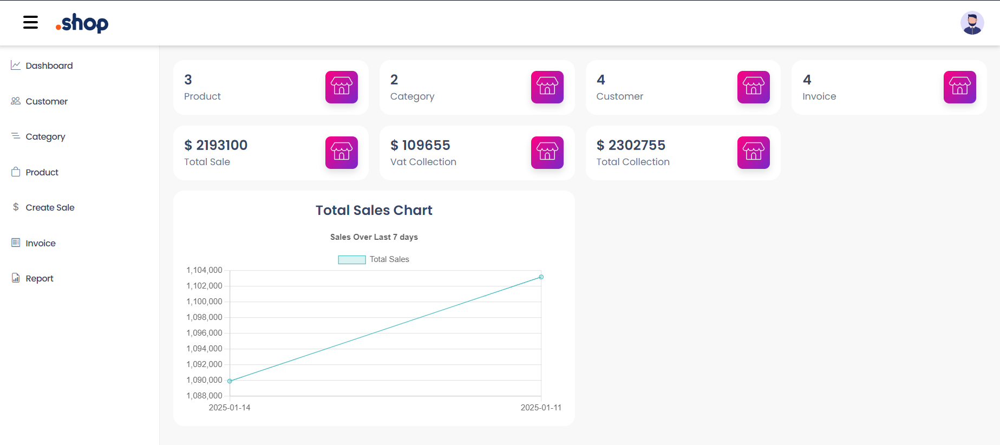
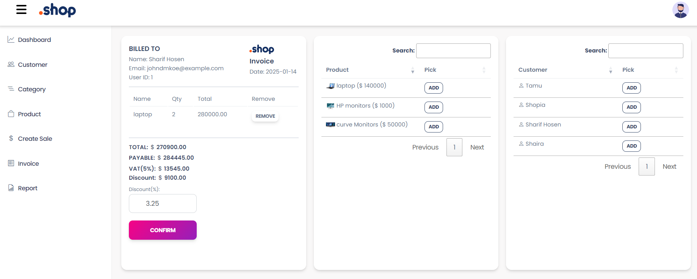
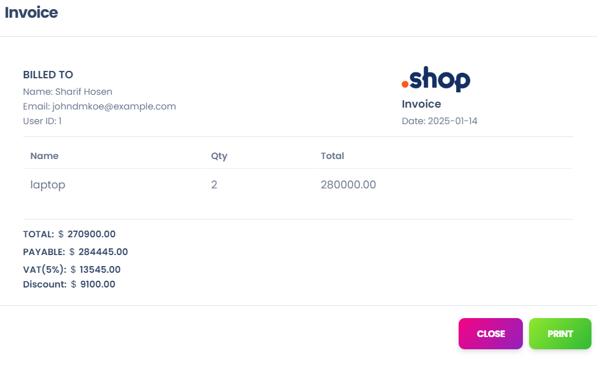
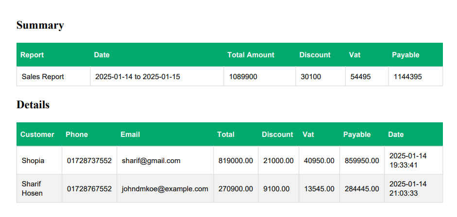
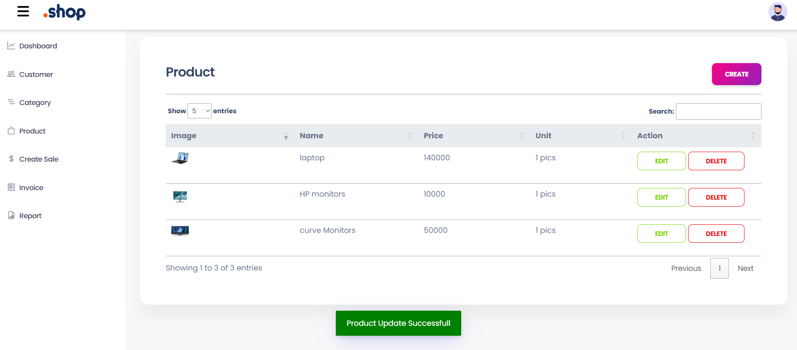

# Point Of Sale Application

## Initial Idea & Problem Statement
This system is designed to help businesses streamline their operations. By leveraging system data, users can make informed decisions, identify inefficiencies, and enhance their business performance.

---

## Features

1. **Product Category Listing**
   - Organize products into categories for efficient management.

2. **Product Listing**
   - Add and manage product details like price, stock, and description.

3. **Sales & Invoice Management**
   - Record sales transactions and generate professional invoices.

4. **Business Report Features**
   - Generate insightful business reports to analyze sales and revenue trends.

5. **Multi-User Functionality**
   - Support multiple businesses by allowing each to create their own profile.

---

## Technologies Used

### Backend:
- **Laravel**: Framework for managing business logic and APIs.
- **JWT (JSON Web Token)**: Secure authentication and authorization.

### Frontend:
- **Blade Templates**: Default Laravel templating engine.
- **jQuery**: For DOM manipulation and AJAX requests.
- **Axios**: For API communication.

### UI Enhancements:
- **Toastify**: For displaying elegant notification messages (e.g., success, error).

### PDF Generation:
- **Dompdf** or **Snappy**: To generate downloadable invoices and reports.

---

## Installation

1. Clone the repository:
      ```bash
          git clone https://github.com/yourusername/Point_Of_Sale.git
          cd pos-application

2. Install dependencies:

     ```bash
        composer install
        npm install
3. Set up environment variables:
   
       Copy .env.example to .env and configure the database, JWT secret, and other settings.
   
4. Generate application key and JWT secret:

        php artisan key:generate
        php artisan jwt:secret
   
5. Run migrations and seed data:

        php artisan migrate --seed
   
6. Start the development server:
   
        php artisan serve
## Usage

### 1. Authentication
- Use **JWT** for secure login and profile management.
- Each user must log in to access their business data.

### 2. Features
- **Product Management**: Add, update, and delete products.
- **Sales**: Record transactions and generate invoices.
- **Reports**: View business reports within a specified date range.

### 3. Notifications
- Success and error messages are displayed using **Toastify**.

### 4. API Calls
- **Axios** is used for handling API requests efficiently.
 
## Screenshots (Optional)

Below are some visual examples of the key features of the POS application:

### 1. ER(Entity Relationship) Diagram


### 2. Home Page


### 3. Login Page


---

### 4. Dashboard page


---

### 5. Sales page


---
### 6. Invoice Details page


---

### 7. Sales Report


---

### 8. Toastify Notifications



## License

This project is licensed under the [MIT License](LICENSE).


## Contact

For any inquiries, feel free to reach out:

- **Name:** Md. Sharif Hosen  
- **Email:** [mdsharifkhan762@gmail.com](mailto:mdsharifkhan762@gmail.com)  
- **GitHub:** [Md-Sharif-Hosen](https://github.com/Md-Sharif-Hosen)  